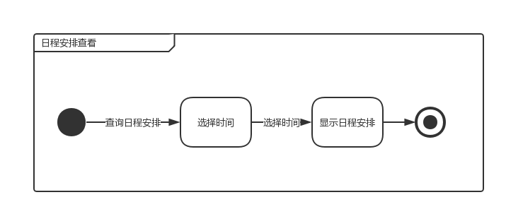

# 分析模型

**南京大学软件学院16级本科**

2018年11月9日

161250024 方渤镕

161250041 侯韵晗

161250029 葛    宇

161250171 徐一舟

[TOC]

## 1. 引言

### 1.1 编制目的

​	本文档用于描述智能课程日程系统在需求工程第三个阶段——需求分析阶段所选用的分析方法、建模方法和建模成果，用于帮助明晰建模过程，方便后续跟踪和评审。

### 1.2 参考资料

1. 骆斌，丁二玉.需求工程------软件建模与分析[M].北京：高等教育出版社，2009:1-112

2. 用例文档

3. 面谈报告

## 2. 领域模型

### 2.1 发现类和对象

### 2.2 建立类之间的关联

### 2.3 添加类的主要属性

## 3. 行为模型

### 3.1 ...

#### 3.1.1 活动图

#### 3.1.2 顺序图

#### 3.1.3 状态图

#### 

#### 3.9 查看日程安排情况

#### 3.9.1 活动图

#### 3.9.2 顺序图

#### 3.9.3 状态图

### 3.10 查看日程分析

#### 3.10.1 活动图

#### 3.10.2 顺序图

#### 3.10.3 状态图

### 3.11 生成和分享待办事项列表

#### 3.11.1 活动图

#### 3.11.2 顺序图

#### 3.11.3 状态图

#### 