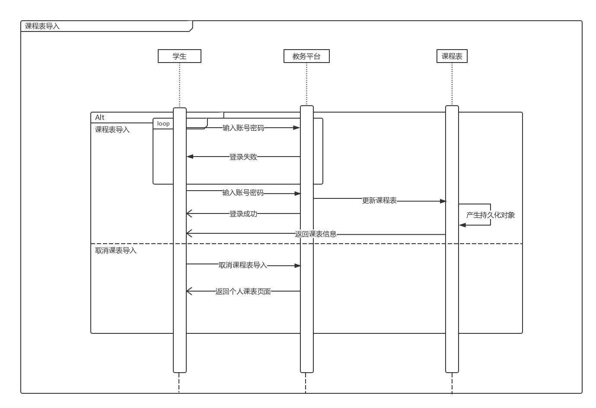
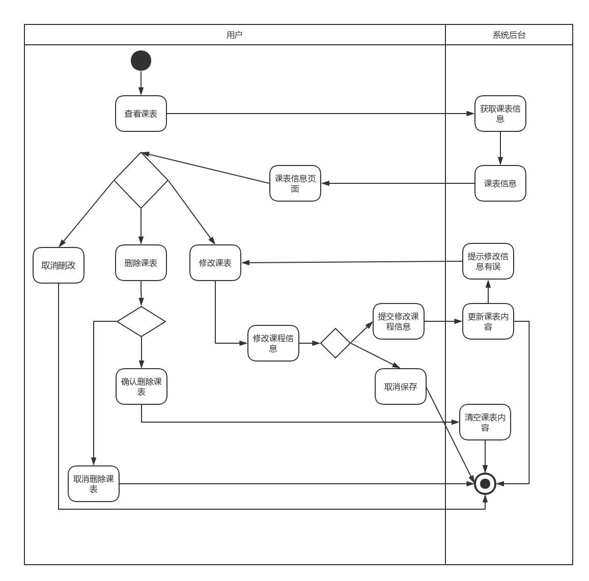
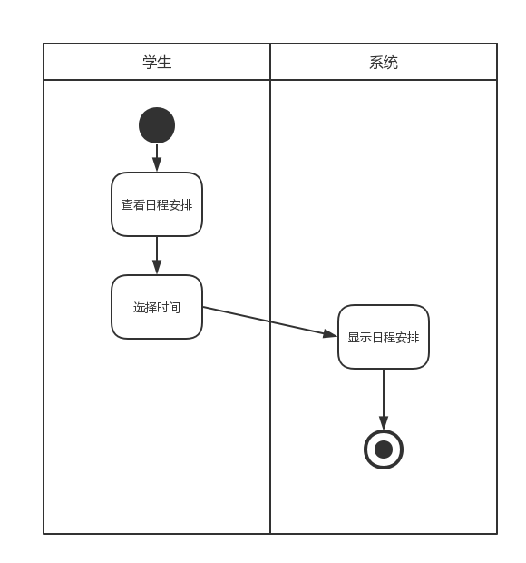
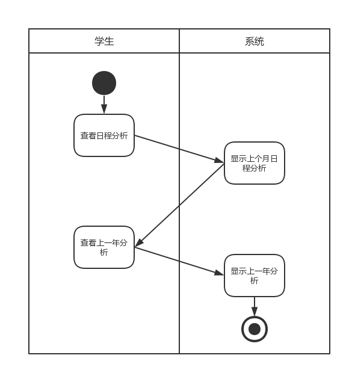
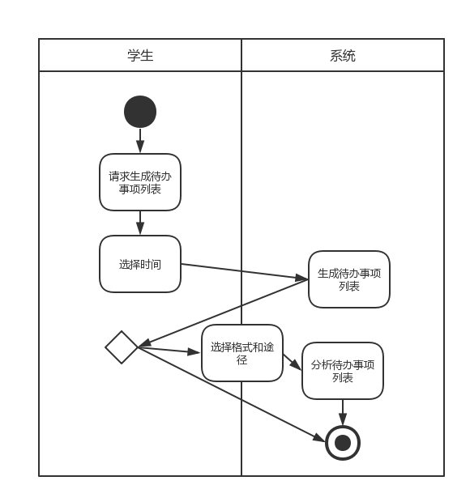

# 分析模型

**南京大学软件学院16级本科**

2018年11月9日

161250024 方渤镕

161250041 侯韵晗

161250029 葛    宇

161250171 徐一舟

[TOC]

## 1. 引言

### 1.1 编制目的

​	本文档用于描述智能课程日程系统在需求工程第三个阶段——需求分析阶段所选用的分析方法、建模方法和建模成果，用于帮助明晰建模过程，方便后续跟踪和评审。

### 1.2 参考资料

1. 骆斌，丁二玉.需求工程------软件建模与分析[M].北京：高等教育出版社，2009:1-112

2. 用例文档

3. 面谈报告

## 2. 领域模型

### 2.1 发现类和对象

### 2.2 建立类之间的关联

### 2.3 添加类的主要属性

## 3. 行为模型

### 3.1 课程表导入

#### 3.1.1 活动图

#### 3.1.2 顺序图

#### 3.1.3 状态图

#### 3.1.4 业务流程
| 正常流程 | 1.学生向系统发起导出课程表的请求；                                                                                                    2.系统向学生提供一个输入教务处账号和密码的登录框；                                                                                  3.学生输入账号和密码；                                                                                                                           4.系统将课程导入，并跳转到课程表栏目下显示课程表； |
| -------- | ------------------------------------------------------------ |
| 扩展流程 | 2a、学生输入的账号或用户名不正确；                                                                                                 1、系统提示登录失败；                                                                                                                           2、学生重新输入账号和用户名；                                                                                                               重复2a操作，直至登录成功，返回正常流程4。 |

### 3.2 课程表手动输入

#### 3.2.1 活动图

#### 3.2.2 顺序图

#### 3.2.3 状态图

#### 3.2.4 业务流程
| 正常流程 | 1.学生向系统发起手动输入课程表的请求；                                                                                             2. 系统返回给用户一个课程表模板；                                                                                                        3.  学生手动输入每天的课程；                                                                                                                  4.  学生点击保存；                                                                                                                                      5.  系统将生成的课表显示在课程表栏目下；  |
| -------- | ------------------------------------------------------------ |
| 扩展流程 | 1a.学生取消输入                                                                                                                                         1.学生点击取消输入；                                                                                                                                     2.重返正常流程第2步。  |
### 3.3 课表删改

#### 3.3.1 活动图

#### 3.3.2 顺序图

#### 3.3.3 状态图

#### 3.3.4 业务流程
| 正常流程 | 1.0                                                                                                                                                              1. 学生向系统发起课程修改请求；                                                                                                           2. 学生将课程修改，并保存；                                                                                                                  3.  系统显示修改完的课表信息；                                                                                                             2.0                                                                                                                                                                1. 学生向系统发起课程删除请求；                                                                                                            2. 学生将课程删除；                                                                                                                                                3. 系统提示删除成功，并显示学生课表为空；  |
| -------- | ------------------------------------------------------------ |
| 扩展流程 | 1a.  学生取消修改                                                                                                                                         1.学生选择取消修改；                                                                                                                                    2.重复正常流程2.0；                                                                                                                                2a. 学生没有课表                                                                                                                                        1.学生删除课表                                                                                                                                           2.系统提示请生成课表；  |

### 3.9 查看日程安排情况

#### 3.9.1 活动图

#### 3.9.2 顺序图

#### 3.9.3 状态图

### 3.10 查看日程分析

#### 3.10.1 活动图

#### 3.10.2 顺序图

#### 3.10.3 状态图

### 3.11 生成和分享待办事项列表

#### 3.11.1 活动图

#### 3.11.2 顺序图

#### 3.11.3 状态图

