# 软件需求规格说明文档

**南京大学软件学院16级本科**

2018年11月8日

161250024 方渤镕

161250041 侯韵晗

161250029 葛    宇

161250171 徐一舟

[TOC]

## 1. 引言

### 1.1 目的

 	本文档描述了智能课程日程系统的功能需求和非功能需求。开发小组的软件系统的实现和验证工作都以此文档为依据。

### 1.2 范围

​	本项目为智能课程日程系统，开发的主要目标是使学生更方便地管理个人课程和日程，实现有规律的生活。

### 1.3 参考文献

​	[1] 需求工程:软件建模与分析，骆斌、丁二玉，高等教育出版社，2009-04-01，ISBN：9787040262957

​	[2] 用例文档

​	[3] 面谈报告

## 2. 总体描述

### 2.1 产品前景

​	对于为每学期导入新课表而苦恼的同学，本系统可以让他们一键导入，省心省力。

​	对于拥有大量自由时间的大学生，本系统可以智能安排日程，且提供日程分析，让他们对自己的日程安排有一个更清晰的认知，帮助他们养成良好的生活节奏。

​	产品支持主流移动操作系统：ios 和 Android

### 2.2 业务需求

​	BR1：第一版应用之后的3个月，90%以上用户通过该系统导入课程

​	BR2：第一版应用之后的3个月，对智能日程的好评率达到90%以上

​	BR3：第一版应用之后的3个月，90%以上的学生通过该系统的标签生成统计信息

​	BR4：第一版应用之后的3个月，该应用的使用量达5万次，分享量达3万次

### 2.3 约束

​	CON1: 系统将支持ios和android两大平台，其中ios平台使用swift语言开发

​	CON2: 支持各种机型和系统版本，对全面屏进行优化，对异形屏适配

​	CON3: 在开发中，开发者要提交设计描述文档和测试报告

​	CON4: 项目使用git进行版本控制

### 2.4 假设和依赖

​	AE1: 学生在从教务网导入课程表时连接了校园网

​	AE2: 学生同意隐私保护条约，在软件内部输入教务系统个人账号和密码

## 3.详细需求描述

### 3.1 对外接口需求

#### 3.1.1 用户界面

系统中部分重要界面如下： 

##### UI1:登录界面 

​       用户必须先注册好该app的账号，之后可选择两种登录方式： 

​       (1). 输入app账号和密码进行登录 

​       (2). 使用其他平台账号和app账号进行绑定登录。 

###### UI1.1

​	用户如果没有账号或忘记账号，可点击注册按钮，根据导航一步步完成账号的注册。 

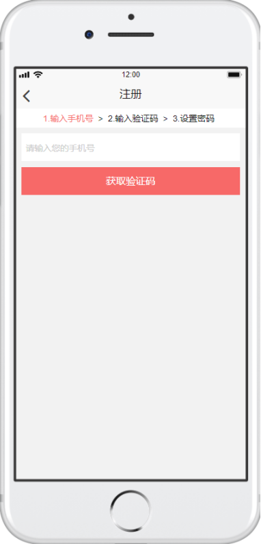   
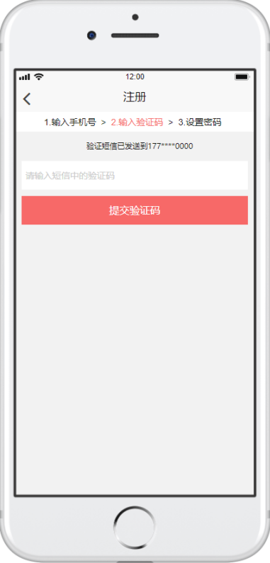   
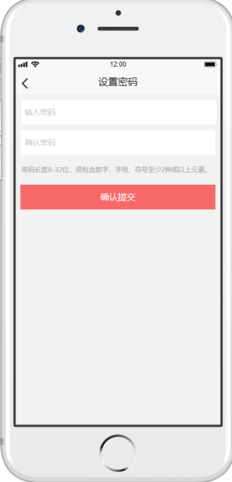   

##### UI2 首页 

​	用户登录后显示个人首页 
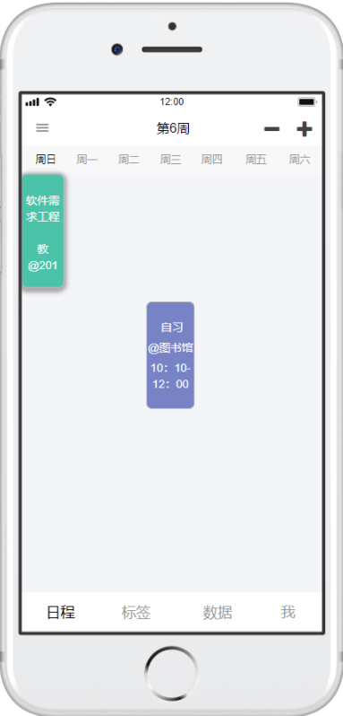    

底部默认显示四个栏目，分别是日程、标签、数据和我（即个人信息）。当点开日程这个栏目时，就是当前显示的界面。 

##### UI3 工具栏显示功能 

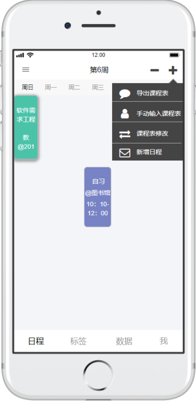   

用户可以选择导出课程表、手动输入课程表、课程表修改、新增日程这四个职能。 

##### UI4 导出课程表 

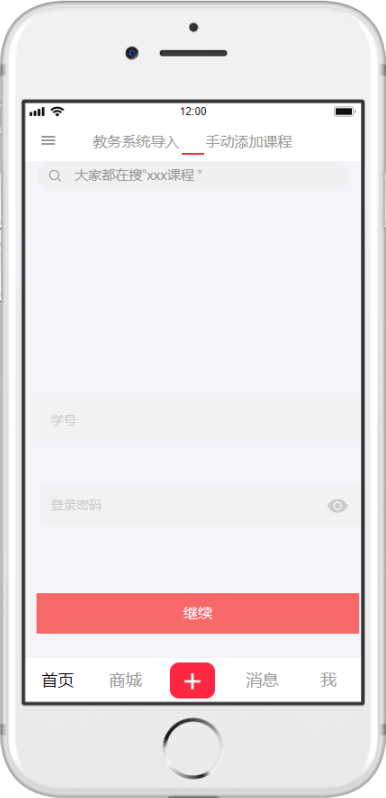   

用户选择导出课程表后，跳入课程表导入页面。输入正确的账号和密码后，系统会跳回到日程页面，将该用户的课表显示在日程栏下。  

##### UI5 手动输入课程表 

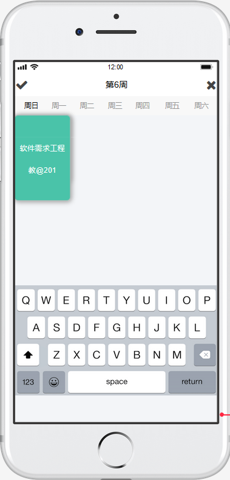   

用户选择手动输入后，跳入手动输入页面。填写完成后，点击√保存课表；点击×号，取消保存。   

##### UI6 课程表修改  

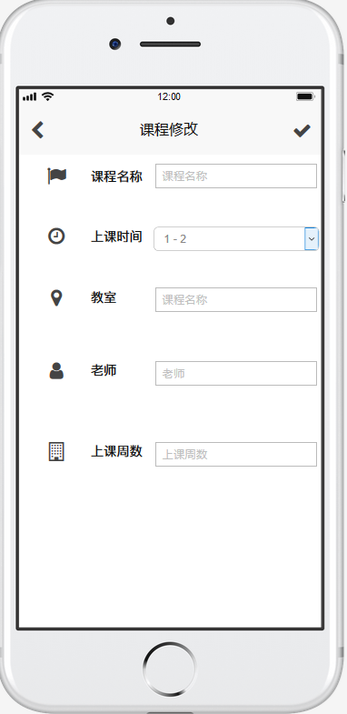    

用户选择课程表修改后，跳入日程修改栏页面。填写完成后，点击√号保存。 

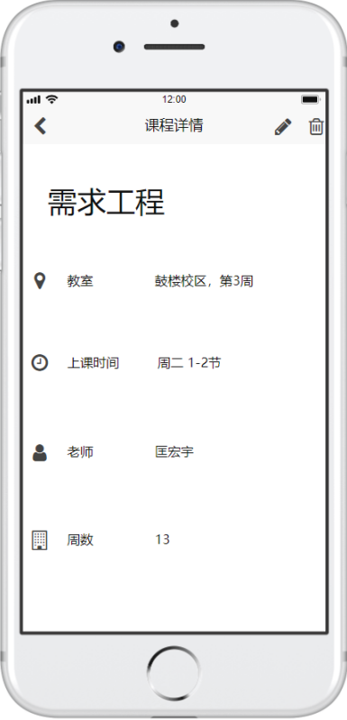
用户也可以查看课程表时，选中要修改的课程，进入课程详细信息页面。 

右上角左边是修改键，右边是删除该课程键。点击修改键后也能跳入课程修改的页面。 

点击-号，删除课程表。 

##### UI 7 标签管理界面

​	标签管理界面：显示标签列表，默认显示全部日程

 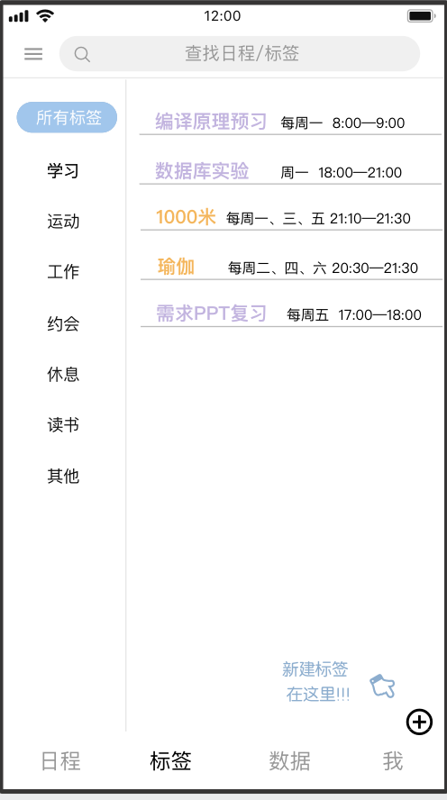

###### UI 7.1 新建标签

​	点击新建标签按钮后，输入标签名称，提交即可。

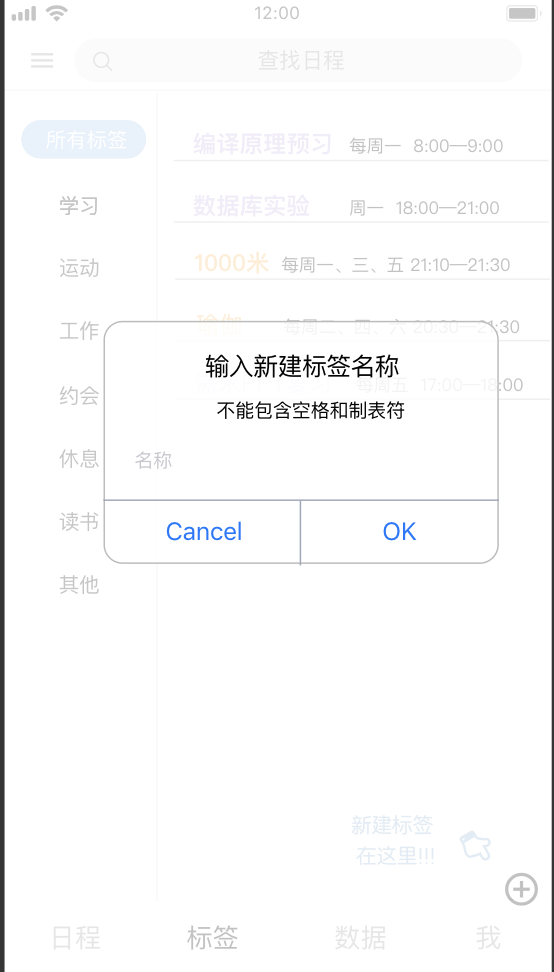

###### UI 7.2 按标签查看日程

​	在左侧标签栏里选择标签，即可查看对应日程列表。

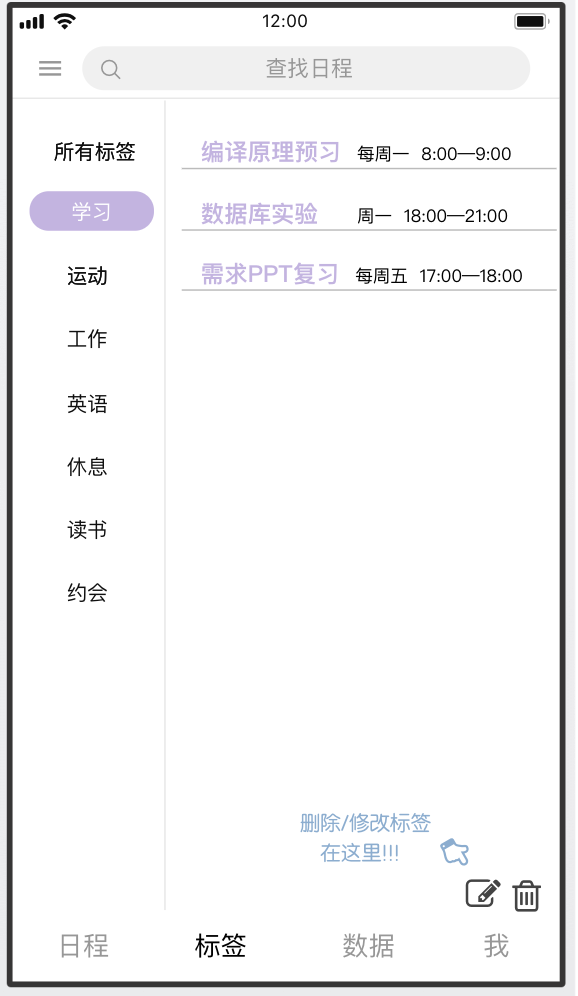

###### UI 7.1.1 删除标签

​	选择标签后，点击删除按钮，并确认删除即可删除该标签。

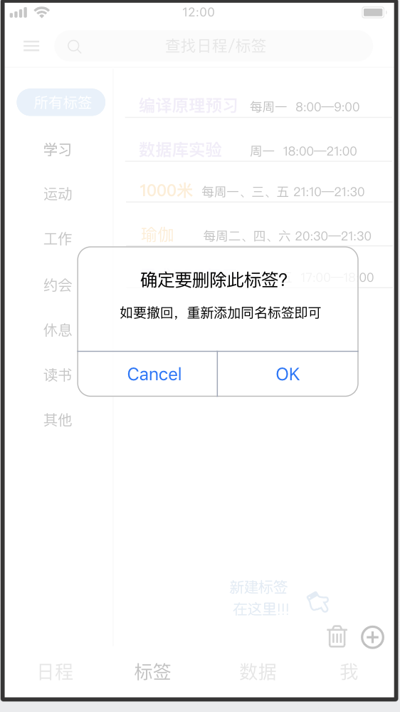

###### UI 7.1.2 修改标签

​	选择标签后，点击修改按钮即可重新命名，提交后标签名称修改。

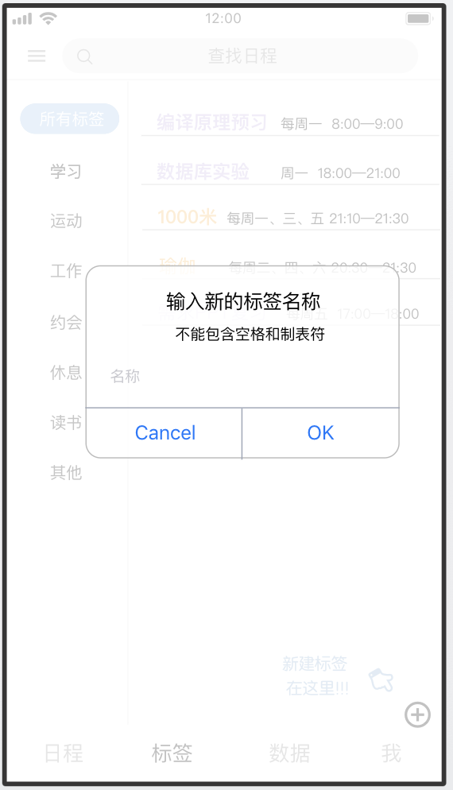

##### UI 8 数据界面

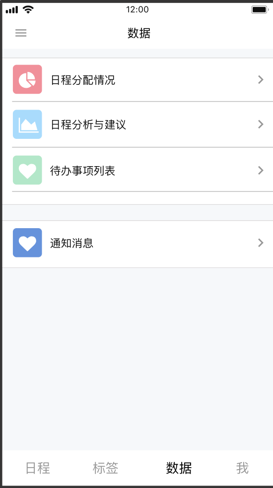

###### UI 8.1 日程分配情况

###### UI 8.1.1 时间段选择

​	选择想要查看的日程时间分配情况的时间段。

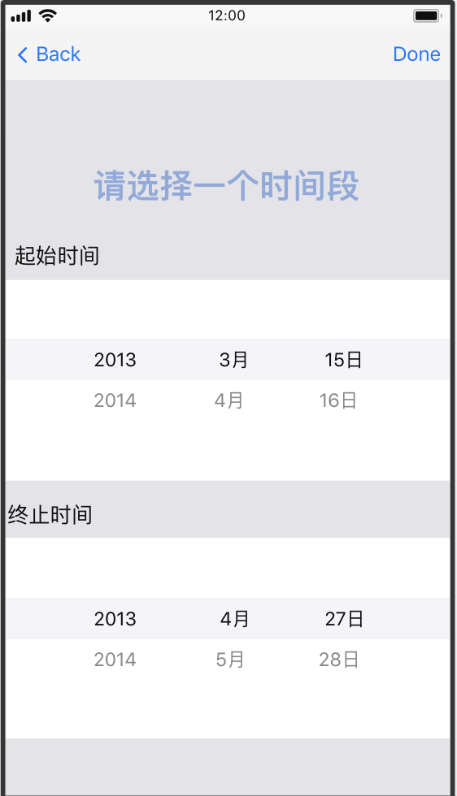

###### UI 8.1.2 日程分配详情

​	显示所选时间段内，各标签对应日程占用的总时间和时间总占百分比。

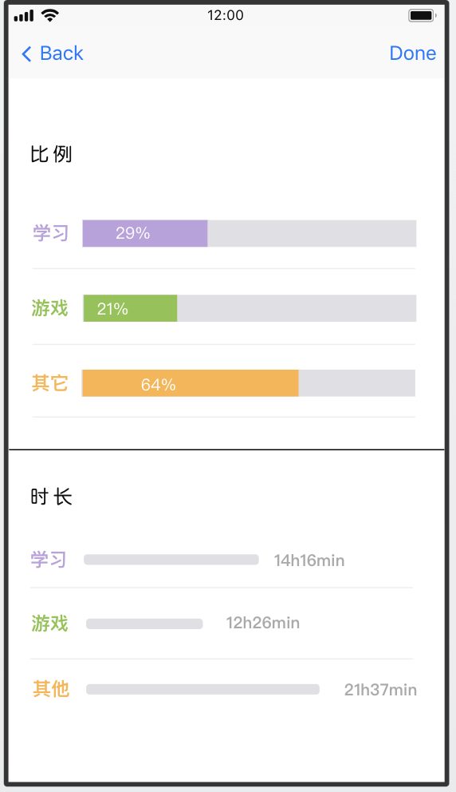

###### UI 8.2 日程分析与建议

​	该界面包含直观的最近一年/一月标签对应日程的总时间占比。以及给出的时间安排改进意见。

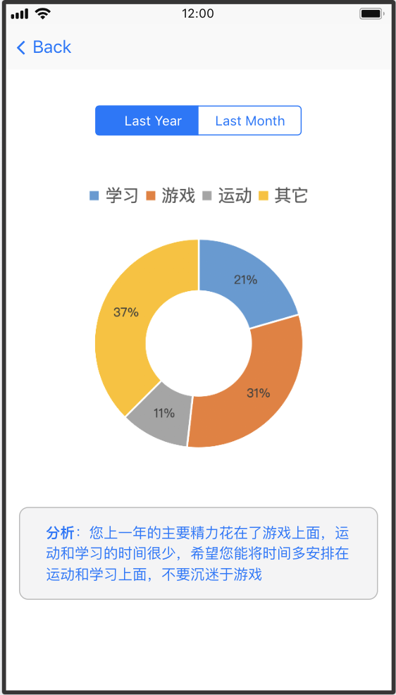

###### UI 8.3 待办事项列表

​	选择查看某日的待办事项列表。

###### UI 8.3.1 日期选择

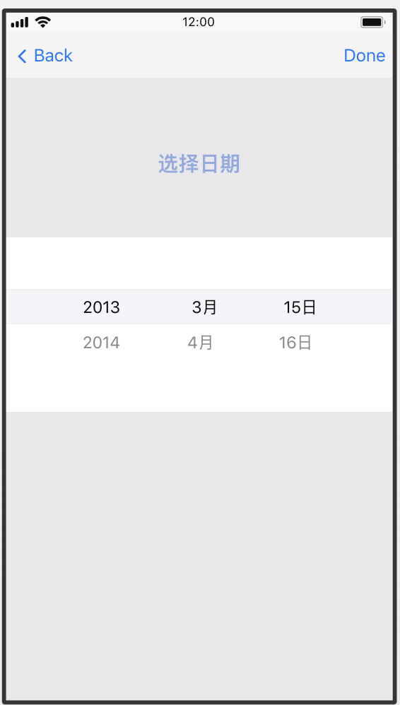

###### UI 8.3.2 待办事项列表详情

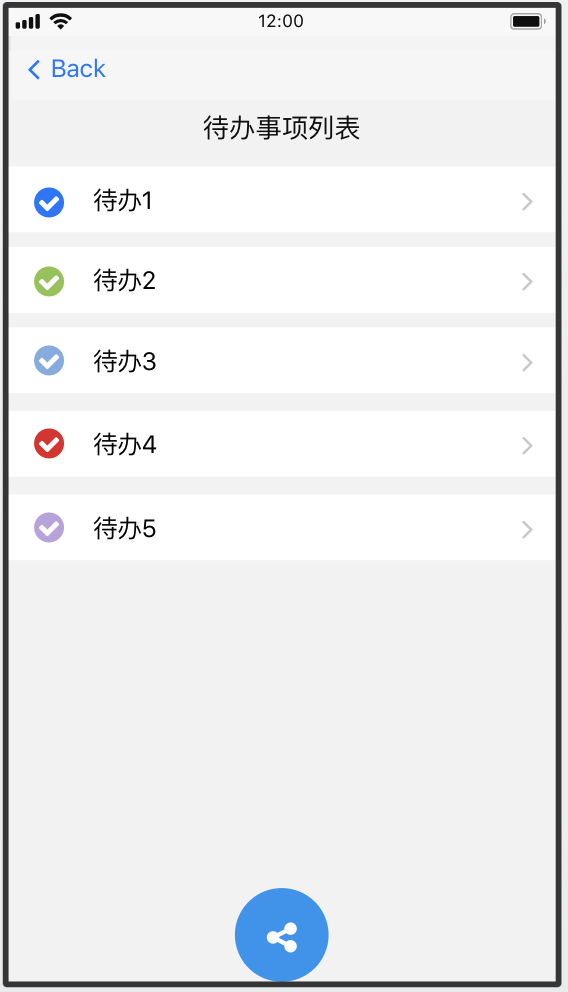

###### UI 8.3.3 分享

​	在待办事项列表中，点击分析按钮，可以选择生成分享的待办事项列表的格式（图片/文本），然后选择要分享到的社交平台。

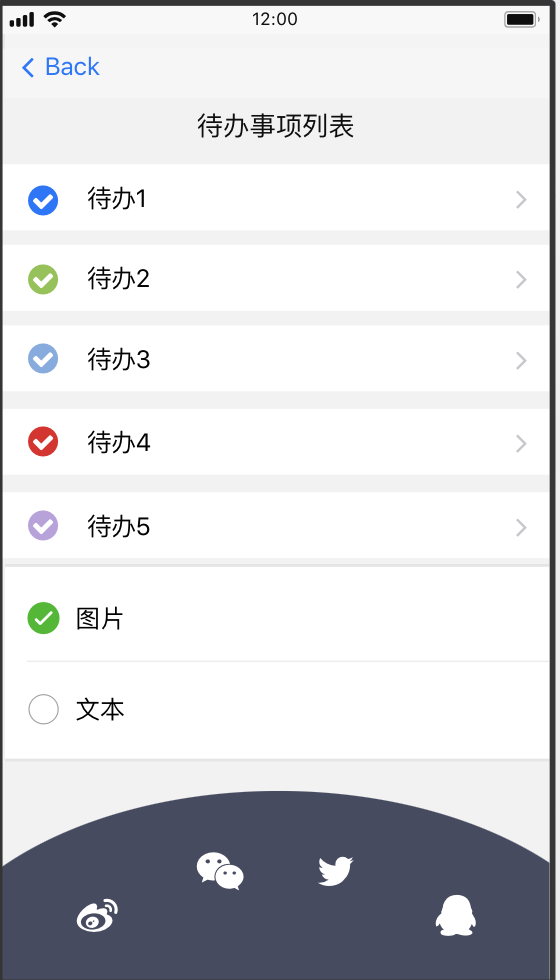

##### UI 9 个人信息页

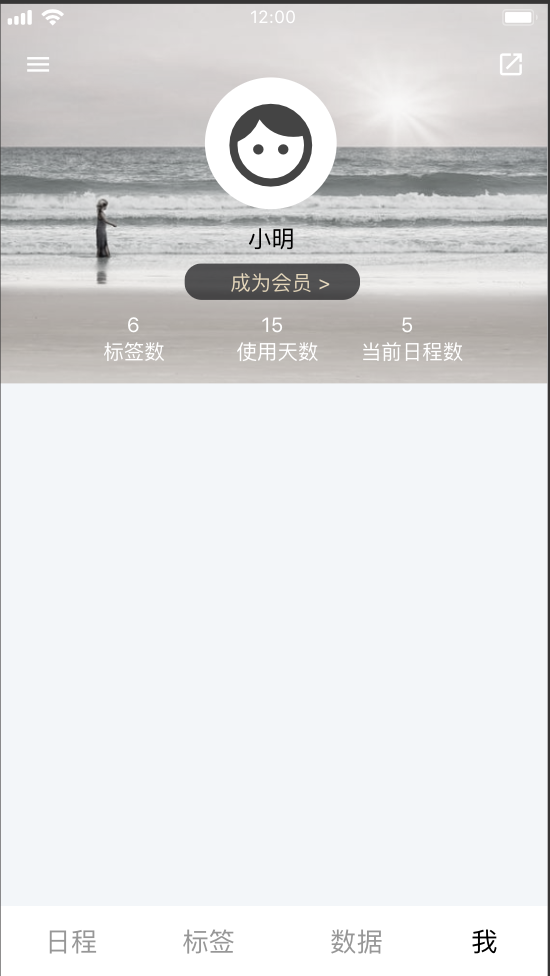

#### 3.1.2 软件接口

| ID   | 需求内容                                               |
| ---- | ------------------------------------------------------ |
| SI1  | 采用mysql数据库，服务器必须安装mysql数据库作为必要软件 |
| SI2  | 分享到社交网络的待办事项列表为图片形式。               |
|      |                                                        |

### 3.2 功能需求

#### 3.2.1 课程表导入

##### 3.2.1.1 特性描述

 学生可以通过教务处接口登录，将自己的课程表导入app平台上 

##### 3.2.1.2  刺激/响应序列

  刺激：用户发起通过教务处登录导入课程表的请求。  

  响应：系统跳转到教务处登录的页面。  

  刺激：用户输入正确的账号和密码进行登录。  

  响应：系统成功获得用户的课程表，并将课程表显示在用户的日程处。  

  刺激：用户输入错误的账号和密码。   

  响应：系统提示账号和密码有误。  

  刺激：用户取消登录。  

  响应：系统返回到用户的主页面。  

##### 3.2.1.3 相关功能需求

| User.requestImportCourses     | 系统应当允许学生发起通过登录教务系统导入课程表的请求         |
| ----------------------------- | ------------------------------------------------------------ |
| User.ImportCourses.login      | 系统应允许学生输入自己的账号和密码登录教务系统               |
| User.ImportCourses.cancel     | 当学生取消课程表导入的请求时，系统应返回到用户的主页面。     |
| User.ImportCourses.login.error | 当学生输入的账号或者密码有误时，系统提示登录失败并给予用户重新输入账号和密码 |

#### 3.2.2      课表手动输入

##### 3.2.2.1   特性描述

学生可以通过手动输入生成自己的课程表 

##### 3.2.2.2   刺激/响应序列

刺激：用户发起课表手动输入的请求。 

响应：系统跳转到空白课表的页面。  

刺激：用户手动输入课表信息。  

响应：系统显示课表的编辑信息。  

刺激：用户保存手动输入的课表。  

响应：系统更新课表并返回到个人主页面。  

刺激：用户取消保存手动输入的课表。  

响应：系统返回到空白课表页面。  

刺激：用户结束手动输入课表。  

响应：系统返回到个人主页面。  

##### 3.2.2.3 相关功能需求

| User.importCoursesByHand             | 系统应当允许学生发起手动输入课表的请求                   |
| ------------------------------------ | -------------------------------------------------------- |
| User.importCoursesByHand.Start       | 当学生进入手动输入课表的页面时，系统应当允许学生输入课表 |
| User.importCoursesByHand.save        | 当学生输入课表结束后，系统应当允许学生保存课表           |
| User.importCoursesByHand.save.cancel | 当学生取消保存课表时，系统应当取消所有输入的课程。       |
| User.importCoursesByHand.End         | 当学生结束手动输入时，系统应当返回个人主页。             |

#### 3.2.3 课表删改

##### 3.2.3.1   特性描述

​     学生可以对课程表进行修改和删除。 

##### 3.2.3.2   刺激/响应序列

刺激：学生发起对课表进行删除的请求。 

响应：系统发出提示是否确认删除。  

刺激：学生确认删除课表。  

响应：系统删除课表，并更新课表信息。  

刺激：学生发起对课表进行修改的请求。 

响应：系统显示课程表信息。    

刺激：学生选中要修改的课程。 

响应：系统提供用户可编辑的目标课程进行修改。 

刺激：学生取消修改课程信息。  

响应：系统应该取消所有更改。  

刺激：学生保存课表修改信息。 
响应：系统更新课表并返回到个人主页。 

#####  3.2.3.3 相关功能需求

| User.deleteCourses               | 系统应当允许学生发起删除课表的请求                           |
| -------------------------------- | ------------------------------------------------------------ |
| User.deleteCourses.confirm       | 当用户选定是否删除课表时，系统根据用户的指示决定是否删除课表 |
| User.modifyCourses               | 系统应当允许用户发起修改课表的请求                           |
| Usrer.modifyCourses.select       | 当用户选择修改的课程后，系统应当允许进入该课程的详细信息页面 |
| User.modifyCourses.select.modify | 当用户请求修改选中课程时，系统应当允许用户编辑该课程         |
| User.modifyCourses.save          | 当用户保存修改内容时，系统应持久化用户更改选项               |
| User.modifyCourses.save.cancel   | 当用户取消保存修改内容时，系统应取消所有更改                 |
| User.modifyCourses.save.error   | 当用户修改的内容不符合要求时，系统应提示错误并要求重新编辑                |
| User.modifyCourses.End   | 当用户结束修改时，系统结束修改课表服务                |

#### 3.2.4 日程新增

##### 3.2.4.1 特性描述
学生可以对日程进行新增。

##### 3.2.4.2 刺激/响应序列
刺激:用户请求新增日程

响应:系统返回新增日程的信息表格

刺激:用户填写日程信息并确认

响应:系统更新日程并返回

刺激:用户填写日程信息不符合格式要求

响应:系统提示错误信息并要求更改

刺激:用户取消新增日程

响应:系统返回日程界面

##### 3.2.4.3 相关功能需求

| 编号 | 需求描述 |
| --------------- | -----------------------|
| Schedule.Add | 系统应当响应用户新增日程请求 |
| Schedule.Add.Confirm | 系统应当允许用户确认新增日程信息 |
| Schedule.Add.Cancel | 系统应当运行用户取消新增日程 |
| Schedule.Add.Save | 当用户确认保存后，系统应当将信息进行持久化保存 |
| Schedule.Add.Check | 当用户确认信息后，系统应当对输入进行检查 |
| Schedule.Add.End | 当用户完成新增日程后，系统应当返回日程界面 |

#### 3.2.5 日程删改
##### 3.2.5.1 特性描述
学生可以对日程进行删改。

##### 3.2.5.2 刺激/响应序列
刺激:用户对选定日程请求修改

响应:系统返回修改信息的信息表格

刺激:用户输入修改后信息并确认

响应:系统更新日程并返回

刺激:用户输入日程信息不符合格式要求

响应:系统提示错误信息并要求修改

刺激:用户取消修改日程

响应:系统返回日程界面

刺激:用户对选定日程请求删除

响应:系统提示确认

刺激:用户确认删除

响应:系统删除并更新日程信息

刺激:用户取消删除

响应:系统返回日程界面

##### 3.2.5.3 相关功能需求

| 编号 | 需求描述 |
| ------------- | -------------- |
| Schedule.Modify | 系统应当响应用户修改日程请求 |
| Schedule.Modify.Confirm | 系统应当允许用户确认修改日程信息 |
| Schedule.Modify.Cancel | 系统应当运行用户取消修改日程 |
| Schedule.Modify.Save | 当用户确认保存后，系统应当将信息进行持久化保存 |
| Schedule.Modify.Check | 当用户确认信息后，系统应当对输入进行检查 |
| Schedule.Modify.End | 当用户完成修改日程后，系统应当返回日程界面 |
| Schedule.Delete | 系统应当响应用户删除日程请求 |
| Schedule.Delete.Confirm | 系统应当运行用户确认删除日程 |
| Schedule.Delete.Save | 当用户确认删除日程后，系统应当更新日程信息 |
| Schedule.Delete.Cancel | 系统应当运行用户取消删除日程 |
| Schedule.Delete.End | 当用户完成删除日程后，系统应当返回日程界面 |

#### 3.2.6 标签增删改

##### 3.2.6.1 特性描述

学生可以对标签进行增删改。

##### 3.2.6.2 刺激/响应序列

刺激:用户选择增加新的标签

响应:系统提示用户输入标签名称

刺激:用户输入标签名称并确认

响应:系统更新标签和日程信息

刺激:用户输入标签名称与已有标签冲突或为空

响应:系统提示输入冲突或为空并要求修改

刺激:用户取消新建标签

响应:系统返回标签界面

刺激:用户对选定标签请求删除

响应:系统显示提示框请求确认

刺激:用户确认删除

响应:系统删除标签并更新日程信息

刺激:用户取消删除

响应:系统返回标签管理界面

刺激:用户选择修改标签名称

响应:系统提示用户输入新的标签名称

刺激:用户输入标签名称并确认

响应:系统更新标签和日程信息

刺激:用户输入标签名称与已有标签冲突或为空

响应:系统提示输入冲突或为空并要求修改

刺激:用户取消修改标签

响应:系统返回标签界面

##### 3.2.6.3 相关功能需求

| 编号                 | 需求描述                                         |
| -------------------- | ------------------------------------------------ |
| Label.Add            | 系统应当响应用户新建标签请求                     |
| Label.Add.Confirm    | 系统应当允许用户确认修改标签请求                 |
| Label.Add.Cancel     | 系统应当允许用户取消修改标签信息                 |
| Label.Add.Save       | 当用户确认保存后，系统应当将信息进行持久化保存   |
| Label.Add.Check      | 当用户确认信息后，系统应当对输入进行检查         |
| Label.Add.End        | 当用户完成新建标签后，系统应当返回标签管理       |
| Label.Delete         | 系统应当响应用户删除标签请求                     |
| Label.Delete.Confirm | 系统应当允许用户确认删除标签                     |
| Label.Delete.Save    | 当用户确认删除标签后，系统应当更新标签和日程信息 |
| Label.Delete.Cancel  | 系统应当允许用户取消删除标签                     |
| Label.Delete.End     | 当用户完成删除标签后，系统应当返回标签管理界面   |
| Label.Modify         | 系统应当响应用户修改标签名称请求                 |
| Label.Modify.Confirm | 系统应当允许用户确认修改标签信息                 |
| Label.Modify.Cancel  | 系统应当允许用户取消修改标签信息                 |
| Label.Modify.Save    | 当用户确认保存后，系统应当将信息进行持久化保存   |
| Label.Modify.Check   | 当用户确认信息后，系统应当对输入进行检查         |
| Label.Modify.End     | 当用户完成修改变迁后，系统应当返回标签管理       |

#### 3.2.7 日程标签增删

##### 3.2.7.1 特性描述

学生可以对日程增删标签。

##### 3.2.7.2 刺激/响应序列

刺激:用户选择给日程增加新的标签

响应:系统提示用户选择想要添加的标签

刺激:用户选择标签

响应:系统显示该日程已添加标签

刺激:用户对选定日程标签请求删除

响应:系统显示提示框请求确认

刺激:用户确认删除

响应:系统显示该日程已删除标签

刺激:用户保存更改

响应:系统更新日程信息，更新数据并返回日程界面

刺激:用户取消更改

响应:系统返回日程界面

##### 3.2.7.3 相关功能需求

| 编号                                | 需求描述                             |
| ----------------------------------- | ------------------------------------ |
| Schedule.ModifyLabel.Add            | 系统应当响应用户给日程新建标签请求   |
| Schedule.ModifyLabel.Add.Choose     | 系统应当允许用户选择标签             |
| Schedule.ModifyLabel.Delete         | 系统应当响应用户给日程删减标签请求   |
| Schedule.ModifyLabel.Delete.Confirm | 系统应当允许用户确认删除日程标签     |
| Schedule.ModifyLabel.Save           | 系统应当允许用户确认修改日程标签信息 |
| Schedule.ModifyLabel.Cancel         | 系统应当允许用户取消修改日程标签     |

#### 3.2.8 日程分类查看

##### 3.2.8.1 特性描述

学生可以按照标签对日程进行查看

##### 3.2.8.2 刺激/响应序列

刺激:用户进入标签界面

响应:系统默认显示全部日程

刺激:用户选择标签进行查看

响应:系统显示拥有该标签的所有日程

##### 3.2.8.3 相关功能需求

| 编号                        | 需求描述                             |
| --------------------------- | ------------------------------------ |
| Schedule.SkimByLabel        | 系统应当响应用户按标签查看日程的请求 |
| Schedule.SkimByLabel.Choose | 系统应当允许用户选择标签来查看日程   |

#### 3.2.9 日程安排的查看

##### 3.2.9.1 特性描述

​	学生可以查看任意时间段内的日程安排情况。

##### 3.2.9.2 刺激/响应序列

​	刺激：用户请求查看日程安排情况

​	响应：系统显示时间选择页面，让用户输入一个时间段

​	刺激：系统显示该时间段内各标签下日程的比例与时长

##### 3.2.9.3 相关功能需求

| 编号                                   | 需求描述                                                   |
| -------------------------------------- | ---------------------------------------------------------- |
| Schedule.Skim.Check                    | 系统应允许用户查看日程安排情况                             |
| Schedule.Skim.Check.ChooseTime         | 用户确定所要查看日程的时间段                               |
| Schedule.Skim.Check.ChooseTime.Confirm | 用户已经选好时间，系统返回该段时间各标签下日程的比例与时长 |
| Schedule.Skim.Check.ChooseTime.Cancle  | 用户放弃查看，系统返回数据页                               |

#### 3.2.10 日程安排建议的查看

##### 3.2.10.1 特性描述

​	学生可以每月查看日程分析与建议。

##### 3.2.10.2 刺激/响应序列

​	刺激：用户请求查看日程安排建议

​	响应：系统返回上一个月的日程比例与日程安排分析

​	刺激：用户可以请求查看上一年的日程安排建议

​	响应：系统返回上一年的日程比例与日程安排分析

##### 3.2.10.3 相关功能需求

| 编号                                  | 需求描述                           |
| ------------------------------------- | ---------------------------------- |
| Schedule.SkimAnalysis                 | 系统允许用户查看日程分析与建议     |
| Schedule.SkimAnalysis.Return          | 用户结束查看，系统返回数据页       |
| Schedule.SkimAnalysis.LastYear        | 系统运行用户查看去年的日程安排分析 |
| Schedule.SkimAnalysis.LastYear.Return | 用户结束查看，系统返回数据页       |

#### 3.2.11 待办事项列表的生成与分享

##### 3.2.11.1 特征描述

​	学生可以生成待办事项列表并分享。

##### 3.2.11.2 刺激/响应序列

​	刺激：用户请求生成并分享待办事项列表

​	响应：系统进入时间选择页面，提示用户输入时间段

​	刺激：用户选择时间段并确认

​	响应：系统显示该时间段内待办日程并提供分享按钮

​	刺激：用户点击分享按钮

​	响应：系统显示分享格式和途径

​	刺激：用户选择格式[和途径]

##### 3.2.11.3 相关功能需求

| 编号                                                         | 需求描述                                     |
| ------------------------------------------------------------ | -------------------------------------------- |
| TodoList.Share                                               | 系统允许用户请求生成待办事项列表并分享       |
| TodoList.Share.ChooseTime                                    | 用户选择时间                                 |
| TodoList.Share.ChooseTime.Confirm                            | 用户确认时间，系统显示待办日程并提供分享按钮 |
| TodoList.Share.ChooseTime.Cancle                             | 用户放弃分享，系统返回数据页                 |
| TodoList.Share.ChooseTime.Confirm.Choose.Confirm.ConfirmRest | 用户选择分享格式                             |

### 

### 3.3 性能需求

| 需求ID | 类别   | 需求内容                        |
| ------ | ------ | ------------------------------- |
| PR1    | 速度   | 教务网导出课程表的时间必须<2s   |
| PR2    | 速度   | 课程/日程的增删改响应时间<0.5s  |
| PR3    | 速度   | 所有的查看与筛选时间都必须<1s   |
| PR4    | 容量   | 系统应该能够存储1000条日程信息  |
| PR5    | 实时性 | 标签增删改后的同步时间必须<0.5s |
|        |        |                                 |

### 3.4 约束

| ID           |                                                              |
| ------------ | ------------------------------------------------------------ |
| Constraint-1 | 系统将支持ios和android两大平台，其中ios平台使用swift语言开发 |
| Constraint-2 | 支持各种机型和系统版本，对全面屏进行优化，对异形屏适配       |
| Constraint-3 | 在开发中，开发者要提交设计描述文档和测试报告                 |
| Constraint-4 | 项目使用git进行版本控制                                      |

### 3.5 质量属性

| ID   | 特征     | 需求内容                                                     |
| ---- | -------- | ------------------------------------------------------------ |
| QR1  | 功能性   | 系统满足用户所需要的所有需求，功能完备。                     |
| QR2  | 可靠性   | 在从教务网导出课程表时，如果网络出现故障/访问被阻止，系统不能出现故障。 网络出现故障时，间隔0.3s再次尝试，再次出现故障，系统提示网络错误。 访问被阻止时，系统提示用户访问被阻止，请求再次输入密码。 |
| QR3  | 易用性   | 学生使用软件2h后，能够熟练掌握日程管理功能。                 |
| QR4  | 效率     | 系统给出日程安排建议的效率较高。                             |
| QR5  | 可维护性 | 系统易于维护，易于进行修改和缺陷剔除。                       |
| QR6  | 可移植性 | 系统属于定制型，不需考虑可移植性。                           |
|      |          |                                                              |

### 3.6 其他需求

暂无

## 附录